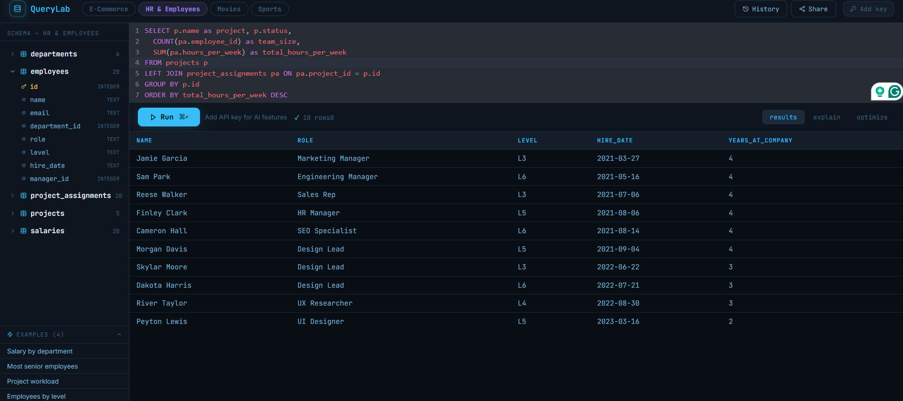
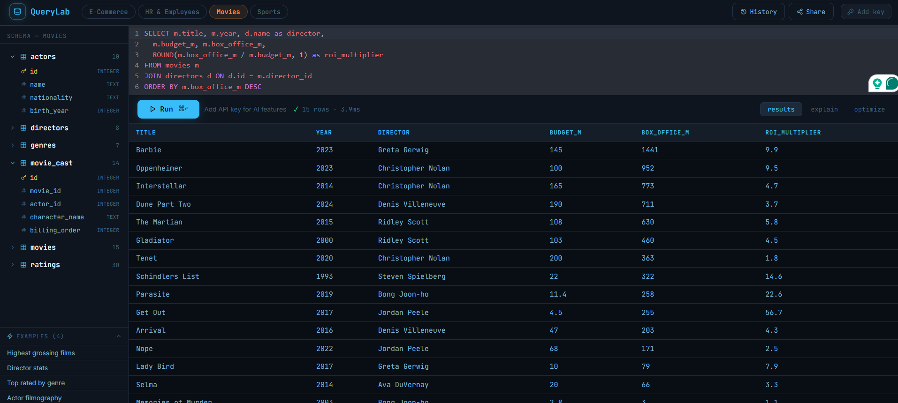
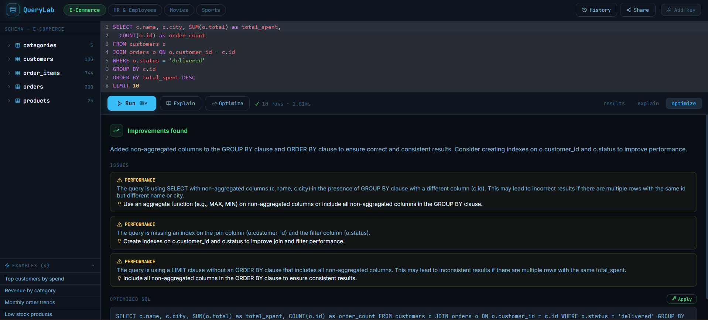
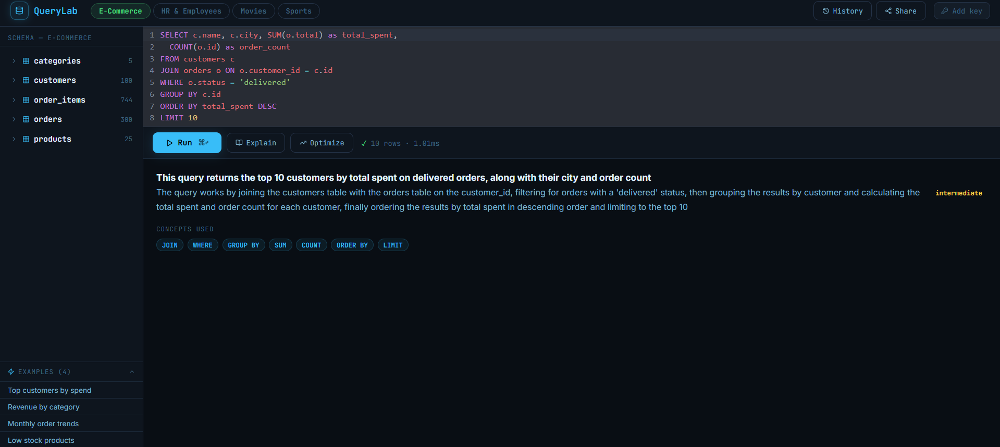
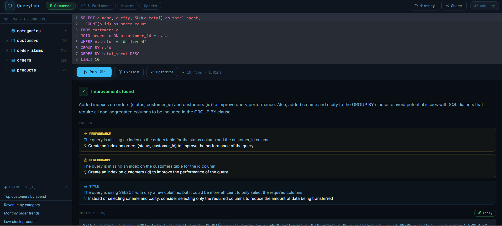

# QueryLab — AI SQL Playground

Write and run SQL against 4 sample databases. AI explains queries, suggests optimizations, and fixes errors.







---
FRONTEND_URL = 

## Sample Databases
- **E-Commerce** — customers, orders, products, categories, order_items
- **HR & Employees** — employees, departments, salaries, projects
- **Movies** — movies, directors, actors, genres, ratings
- **Sports** — teams, players, games, game_stats, standings

## Features
- CodeMirror SQL editor with syntax highlighting
- Real query execution (SELECT only, sandboxed)
- AI Explain — plain English explanation + concepts used
- AI Optimize — finds issues, rewrites inefficient queries
- AI Fix — auto-fixes broken SQL on error
- Share queries via URL slug
- Query history panel
- Schema browser with column types

## Run

### Backend
```bash
cd backend
py -3.12 -m venv venv
venv\Scripts\activate
pip install -r requirements.txt
copy .env.example .env
# Add GROQ_API_KEY for AI features (optional)
uvicorn app.main:app --reload
```

### Frontend
```bash
cd frontend
npm install
npm run dev
```

## Git — First Push
```bash
cd querylab
git init
git add .
git commit -m "day 24: QueryLab - AI SQL playground with 4 sample databases"
git branch -M main
git remote add origin https://github.com/Susmithay08/QueryLab.git
git push -u origin main
```

## Deploy on Render

### Backend — Web Service
| Setting | Value |
|---------|-------|
| Root Directory | `backend` |
| Build Command | `pip install -r requirements.txt` |
| Start Command | `uvicorn app.main:app --host 0.0.0.0 --port $PORT` |
| Instance Type | Free tier works |

**Environment Variables:**
```
GROQ_API_KEY = your_key (optional)
FRONTEND_URL = https://your-frontend.onrender.com
```

### Frontend — Static Site
| Setting | Value |
|---------|-------|
| Root Directory | `frontend` |
| Build Command | `npm install && npm run build` |
| Publish Directory | `dist` |

**Environment Variables:**
```
VITE_API_URL = https://your-backend.onrender.com
```
